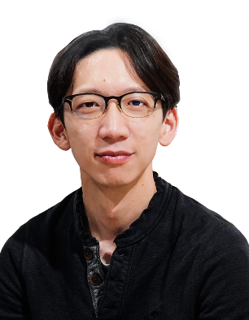
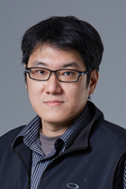
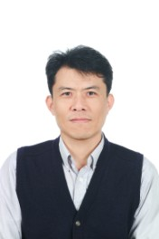
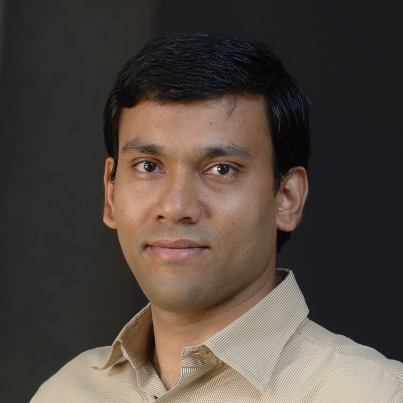

 
 

<!--

  

    <h1 style="color:white;">Keynotes</h1>
  

  -->

<h2> Lectures </h2>

<button class="collapsible"><b>Lecture 1: PSP for Health</b>   Chi-Chun Lee</button>

 

<strong>Syllabus:</strong> 

Overview
<ul>
  <li style="font-size:16.5px;"> Source-filter model of speech production </li>
  <li style="font-size:16.5px;"> Prosody, source, and spectrum based acoustic features </li> 
  <li style="font-size:16.5px;"> Speaker states and traits </li> 
</ul>
Foundational Knowledge
<ul>
  <li style="font-size:16.5px;"> Low-level descriptors </li>
  <li style="font-size:16.5px;"> Multi-leveled aggregation and modeling </li> 
  <li style="font-size:16.5px;"> Toward end-to-end representation </li> 
</ul>
Health Applications
<ul>
  <li style="font-size:16.5px;"> Speech paralinguistics for assessment and diagnosis </li>
  <li style="font-size:16.5px;"> Emerging topics </li> 
</ul>
 

<strong>Speaker Bio:</strong> Chi-Chun Lee (Jeremy) is an Associate Professor at the Department of Electrical Engineering of the National Tsing Hua University (NTHU), Taiwan. He received his B.S. degree and Ph.D. degree in Electrical Engineering from the University of Southern California (USC), USA in 2007 and 2012. He is an IEEE senior member. His research interests are in speech and language, affective computing, health analytics, and behavior signal processing. He is an associate editor for the IEEE Transaction on Affective Computing (2020-), the IEEE Transaction on Multimedia (2019-2020), the Journal of Computer
Speech and Language (2021-). He is a TPC member for APSIPA IVM and MLDA committee. He serves as an area chair for INTERSPEECH 2016, 2018, 2019, senior program committee for ACII 2017, 2019, publicity chair for ACM ICMI 2018, late breaking result chair for ACM ICMI 2023, sponsorship and special session chair for ISCSLP 2018, 2020, and a guest editor in Journal of Computer Speech and Language on special issue of Speech and Language Processing for Behavioral and Mental Health. He led a team to the 1st place in Emotion Challenge in INTERSPEECH 2009 and won the 1st place in Styrian Dialect and Baby Sound challenge in INTERSPEECH 2019. He is a co-author on the best paper award/finalist in major conferences such as INTERSPEECH, IEEE EMBC, and APSIPA ASC and the most cited paper published in 2013 in Journal of Speech Communication. He is the recipient of the Foundation of Outstanding Scholar's Young Innovator Award (2020), the CIEE Outstanding Young Electrical Engineer Award (2020), the IICM K. T. Li Young Researcher Award (2020).

 

<button class="collapsible"><b>Lecture 2: SE for Health</b>   Yu Tsao</button>

 

<strong>Syllabus:</strong> 

Overview
<ul>
  <li style="font-size:16.5px;"> What is speech enhancement (SE) </li>
  <li style="font-size:16.5px;"> Deep learning (DL) based SE </li> 
  <li style="font-size:16.5px;"> SE for assistive hearing technologies </li> 
</ul>
Foundational Knowledge
<ul>
  <li style="font-size:16.5px;"> Traditional SE approaches </li>
  <li style="font-size:16.5px;"> DL-based SE approaches </li> 
  <li style="font-size:16.5px;"> SE for assistive hearing technologies </li> 
</ul>
Health Applications
<ul>
  <li style="font-size:16.5px;"> Goal-driven SE for assistive hearing technologies </li>
  <li style="font-size:16.5px;"> Multimodal assistive hearing technologies </li> 
</ul>
 

<strong>Speaker Bio:</strong> Yu Tsao (Senior Member, IEEE) received the B.S. and M.S. degrees in electrical engineering from National Taiwan University, Taipei, Taiwan, in 1999 and 2001, respectively, and the Ph.D. degree in electrical and computer engineering from the Georgia Institute of Technology, Atlanta, GA, USA, in 2008. From 2009 to 2011, he was a Researcher with the National Institute of Information and Communications Technology, Tokyo, Japan, where he engaged in research and product development in automatic
speech recognition for multilingual speech-to-speech translation. He is currently a Research Fellow
(Professor) and Deputy Director with the Research Center for Information Technology Innovation,
Academia Sinica, Taipei, Taiwan. He is also a Jointly Appointed Professor with the Department of Electrical
Engineering at Chung Yuan Christian University, Taoyuan City, Taiwan. His research interests include
assistive oral communication technologies, audio coding, and bio-signal processing. He is currently an
Associate Editor for the IEEE/ACM TRANSACTIONS ON AUDIO, SPEECH, AND LANGUAGE PROCESSING and IEEE SIGNAL PROCESSING LETTERS. He received the Academia Sinica Career Development Award in 2017, National Innovation
Awards in 2018-2021, Future Tech Breakthrough Award 2019, and Outstanding Elite Award, Chung Hwa Rotary Educational Foundation 2019–2020. He is a coauthor of a paper that received the 2021 IEEE Signal Processing Society (SPS) Young Author Best Paper Award.

 

<button class="collapsible"><b>Lecture 3: TTS/VC for Health</b>   Hsin-Min Wang, Yi-Chiao Wu</button>

 

<strong>Syllabus:</strong> 

Overview
<ul>
  <li style="font-size:16.5px;"> What are text to speech synthesis (TTS) and voice conversion (VC) </li>
  <li style="font-size:16.5px;"> The analysis-mapping-synthesis pipeline </li> 
  <li style="font-size:16.5px;"> Technological advancements of TTS and VC </li> 
</ul>
Foundational Knowledge
<ul>
  <li style="font-size:16.5px;"> Acoustic modeling of TTS </li>
  <li style="font-size:16.5px;"> Acoustic transformation of VC </li> 
  <li style="font-size:16.5px;"> Vocoding </li> 
</ul>
Health Applications
<ul>
  <li style="font-size:16.5px;"> Electrolaryngeal speech voice conversion </li>
  <li style="font-size:16.5px;"> Other health-related TTS and VC applications </li> 
</ul>
 

<strong>Speakers Bio:</strong> Hsin-Min Wang received the B.S. and Ph.D. degrees in electrical engineering from National Taiwan University, Taipei, Taiwan, in 1989 and 1995, respectively. In October 1995, he joined the Institute of Information Science, Academia Sinica, Taipei, Taiwan, where he is currently a Research Fellow. He also holds a joint appointment as a Professor in the Department of Computer Science and Information Engineering at National Cheng Kung University. He was an Associate Editor of IEEE/ACM Transactions on Audio, Speech and Language Processing from 2016 to 2020. He currently serves as an Editorial
Board Member of APSIPA Transactions on Signal and Information Processing. His major research interests
include spoken language processing, natural language processing, multimedia information retrieval,
machine learning and pattern recognition. He was a General Co-Chair of ISCSLP2016 and ISCSLP2018,
a Technical Co-Chair of ISCSLP2010, O-COCOSDA2011, APSIPAASC2013, ISMIR2014, and ASRU2019, and an area chair of INTERSPEECH2019 and INTERSPEECH2020. He received the Chinese Institute of Engineers Technical
Paper Award in 1995 and the ACM Multimedia Grand Challenge First Prize in 2012. He was an APSIPA
distinguished lecturer for 2014–2015. He is a member of IEEE, ISCA, and ACM.
 
 
Yi-Chiao Wu received the B.S. and M.S. degrees in engineering from the School of Communication
Engineering, National Chiao Tung University, Hsinchu, Taiwan, in 2009 and 2011, respectively, and
the Ph.D. degree from the Graduate School of Informatics, Nagoya University, Nagoya, Japan, in
2021. He worked at Realtek, ASUS, Academia Sinica, and Nagoya University for six years. He is currently
working as a Postdoc Researcher at the Institute of Information Science, Academia Sinica, Taipei,
Taiwan. His research focuses on speech generation applications based on machine learning methods,
such as voice conversion and speech enhancement.

 

<button class="collapsible"><b>Lecture 4: ASR for Health</b>  Prasanta Kumar Ghosh</button>

 

<strong>Syllabus:</strong> 

Overview
<ul>
  <li style="font-size:16.5px;"> What is speech recognition </li>
  <li style="font-size:16.5px;"> Challenges for ASR </li> 
  <li style="font-size:16.5px;"> ASR in health application </li> 
</ul>
Foundational Knowledge
<ul>
  <li style="font-size:16.5px;"> Overview of an ASR system </li>
  <li style="font-size:16.5px;"> Different acoustic modeling techniques </li> 
  <li style="font-size:16.5px;"> Different language modeling techniques </li> 
</ul>
Health Applications
<ul>
  <li style="font-size:16.5px;"> Low resource scenario </li>
  <li style="font-size:16.5px;"> Speaker specific vs independent model </li> 
</ul>
 

<strong>Speaker Bio:</strong> Prasanta Kumar Ghosh received his Ph.D. in Electrical Engineering from University of Southern California (USC), Los Angeles, USA in 2011. Prior to that he obtained his M.Sc.(Engineering) in Electrical Communication Engineering from Indian Institute of Science (IISc), Bangalore and B.E.(ETCE) in Electronics from Jadavpur University, Kolkata in 2006 and 2003 respectively. He has been a Research Intern at Microsoft Research India, Bangalore in the areas of audio-visual speaker verification from March to July in 2006. During 2011-2012 he was with IBM India Research Lab (IRL) as a researcher. Currently, he is an associate professor in the department of Electrical Engineering (EE) at IISc.
 
  Prasanta Kumar Ghosh was awarded the INSPIRE faculty fellowship from Department of Science and
Technology (DST), Govt. of India in 2012. He received the best M.Sc. (Engg.) thesis award for the
year 2006-07 in the Electrical Sciences division at IISc. He was awarded Center of Excellence in
Teaching's award for excellence in teaching in the category of EE for the year 2010-11 in USC. He has
also received Prof. Priti Shankar Teaching Award for Assistant Professor in 2017 from Indian Institute of
Science (IISc), Bangalore. His research interests include human centered signal processing, engineering model and technology development with applications to education and health care.

 

